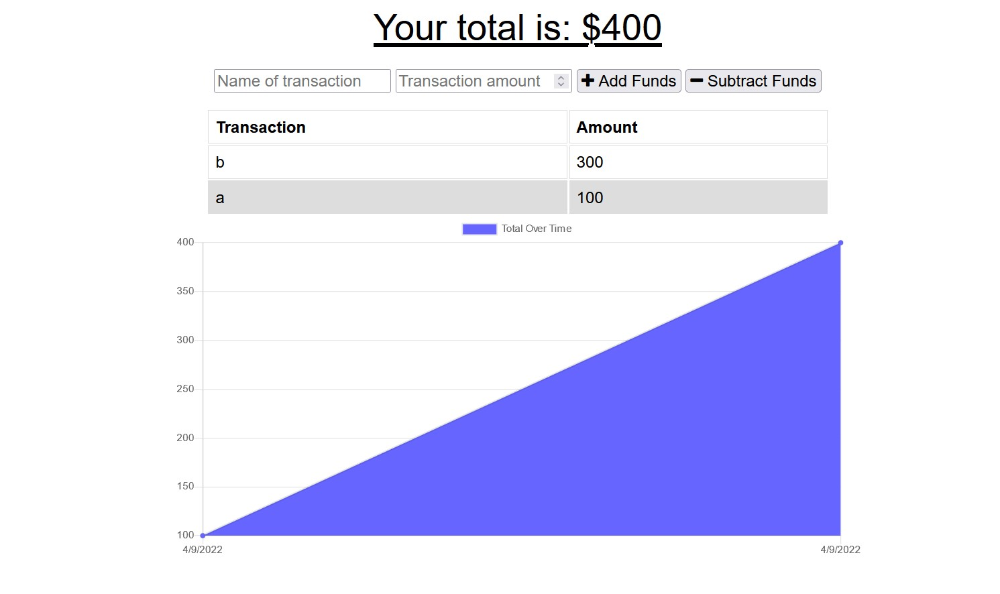

# Vacation Budget Tracker

## Description 
An progressive web application (PWA) that allows a user to track positive or negative budget transactions and will show the graph over time.  As a progressive web application, it can be use without an active internet connection.  On reestablishing a connection it will upload all offline transactions.

## Technology used
* MongoDb
* Mongoose 
* Express

## Instructions
* Enter a transaction name and transaction value
* Click add button to increase total allocation
* Click subtract button to expend allocation

Offline functionality is handled automatically and should be invisible to the user. 

## Screenshot

## Deployed application
[Link to deployed application](https://aneslin-budget-tracker.herokuapp.com/)